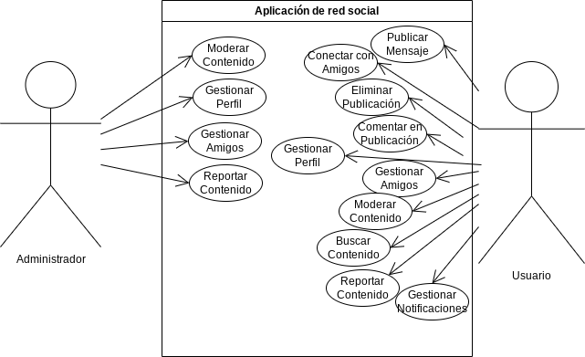

# Diagrama de Casos de Uso: Aplicación de Red Social

## Actores
- Usuario
- Administrador

## Casos de Uso

### 1. Publicar Mensaje
**Descripción:** El usuario puede publicar mensajes en la red social.

### 2. Conectar con Amigos
**Descripción:** El usuario puede conectarse con amigos en la red social.

**Flujo Principal:**
1. El usuario busca y selecciona amigos para conectar.
2. La solicitud de conexión es enviada a los amigos seleccionados.
3. Los amigos aceptan la solicitud de conexión.

**Flujos Alternativos:**
- Si los amigos rechazan la solicitud, se notifica al usuario.

### 3. Eliminar Publicación
**Descripción:** El usuario puede eliminar sus propias publicaciones.

### 4. Comentar en Publicación
**Descripción:** El usuario puede dejar comentarios en las publicaciones de otros usuarios.

### 5. Gestionar Perfil
**Descripción:** El usuario puede gestionar la información de su perfil.

**Flujo Principal:**
1. El usuario puede actualizar información personal en su perfil.
2. El usuario puede cambiar la configuración de privacidad.

### 6. Gestionar Amigos
**Descripción:** El usuario puede gestionar su lista de amigos.

**Flujo Principal:**
1. El usuario puede ver la lista de amigos.
2. El usuario puede enviar solicitudes de conexión.
3. El usuario puede aceptar o rechazar solicitudes de conexión.

### 7. Moderar Contenido
**Descripción:** El administrador puede moderar el contenido de la red social.

**Flujo Principal:**
1. El administrador puede eliminar publicaciones inapropiadas.
2. El administrador puede suspender o bloquear usuarios.

### 8. Reportar Contenido
**Descripción:** El usuario puede reportar contenido inapropiado.

**Flujo Principal:**
1. El usuario selecciona el contenido a reportar.
2. El usuario describe la razón del reporte.

### 9. Buscar Contenido
**Descripción:** El usuario puede buscar contenido en la red social.

**Flujo Principal:**
1. El usuario ingresa palabras clave de búsqueda.
2. La aplicación muestra resultados relevantes.

### 10. Gestionar Notificaciones
**Descripción:** El usuario puede gestionar las notificaciones recibidas.

**Flujo Principal:**
1. El usuario puede ver las notificaciones pendientes.
2. El usuario puede marcar notificaciones como leídas.

