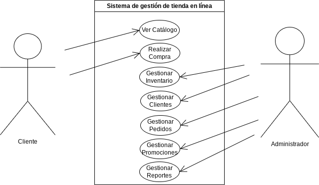

# Diagrama de Casos de Uso: Sistema de Gestión de Tienda en Línea

## Actores
- Cliente
- Administrador

## Casos de Uso

### 1. Ver Catálogo
**Descripción:** El cliente puede ver el catálogo de productos en la tienda en línea.

### 2. Realizar Compra
**Descripción:** El cliente puede realizar una compra de productos en la tienda en línea.

**Flujo Principal:**
1. El cliente agrega productos al carrito.
2. El cliente proporciona información de pago.
3. El sistema procesa la compra y realiza el pago.

**Flujos Alternativos:**
- Si la información de pago es incorrecta, el sistema notifica al cliente.

### 3. Gestionar Inventario
**Descripción:** El administrador puede gestionar el inventario de productos.

**Flujo Principal:**
1. El administrador puede agregar nuevos productos al inventario.
2. El administrador puede actualizar la información de productos existentes.
3. El administrador puede eliminar productos del inventario.

### 4. Gestionar Clientes
**Descripción:** El administrador puede gestionar la información de los clientes.

**Flujo Principal:**
1. El administrador puede ver la lista de clientes registrados.
2. El administrador puede actualizar la información de clientes.
3. El administrador puede eliminar cuentas de clientes.

### 5. Gestionar Pedidos
**Descripción:** El administrador puede gestionar los pedidos realizados.

**Flujo Principal:**
1. El administrador puede ver la lista de pedidos realizados.
2. El administrador puede actualizar el estado de los pedidos.
3. El administrador puede eliminar pedidos.

### 6. Gestionar Promociones
**Descripción:** El administrador puede gestionar promociones y descuentos.

**Flujo Principal:**
1. El administrador puede crear nuevas promociones.
2. El administrador puede actualizar información de promociones existentes.
3. El administrador puede eliminar promociones.

### 7. Gestionar Reportes
**Descripción:** El administrador puede generar y revisar reportes de ventas y estadísticas.

**Flujo Principal:**
1. El administrador puede generar reportes de ventas.
2. El administrador puede revisar estadísticas de ventas.

