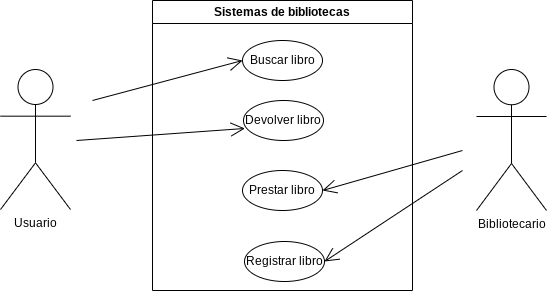

# Diagrama de Casos de Uso: Sistema de Biblioteca

## Actores
- Usuario
- Bibliotecario

## Casos de Uso

### 1. Prestar Libro
**Descripción:** El usuario solicita prestar un libro.

**Flujo Principal:**
1. El usuario solicita prestar un libro.
2. El sistema verifica la disponibilidad del libro.
3. El bibliotecario registra el préstamo del libro.
4. El usuario recibe el libro prestado.

**Flujos Alternativos:**
- Si el libro no está disponible, el sistema notifica al usuario.

### 2. Devolver Libro
**Descripción:** El usuario devuelve un libro prestado.

**Flujo Principal:**
1. El usuario solicita devolver un libro.
2. El sistema verifica la validez de la devolución.
3. El bibliotecario registra la devolución del libro.
4. El usuario entrega el libro devuelto.

**Flujos Alternativos:**
- Si la devolución no es válida, el sistema notifica al usuario.

### 3. Buscar Libro
**Descripción:** El usuario busca un libro en el catálogo de la biblioteca.

**Flujo Principal:**
1. El usuario ingresa el título o autor del libro que busca.
2. El sistema muestra los resultados de la búsqueda.

### 4. Registrar Nuevo Libro
**Descripción:** El bibliotecario registra un nuevo libro en el sistema.

**Flujo Principal:**
1. El bibliotecario ingresa los detalles del nuevo libro.
2. El sistema registra el libro en el catálogo.

### 5. Gestionar Usuario
**Descripción:** El bibliotecario gestiona la información de los usuarios.

**Flujo Principal:**
1. El bibliotecario accede a la información del usuario.
2. Puede agregar, modificar o eliminar información del usuario.

