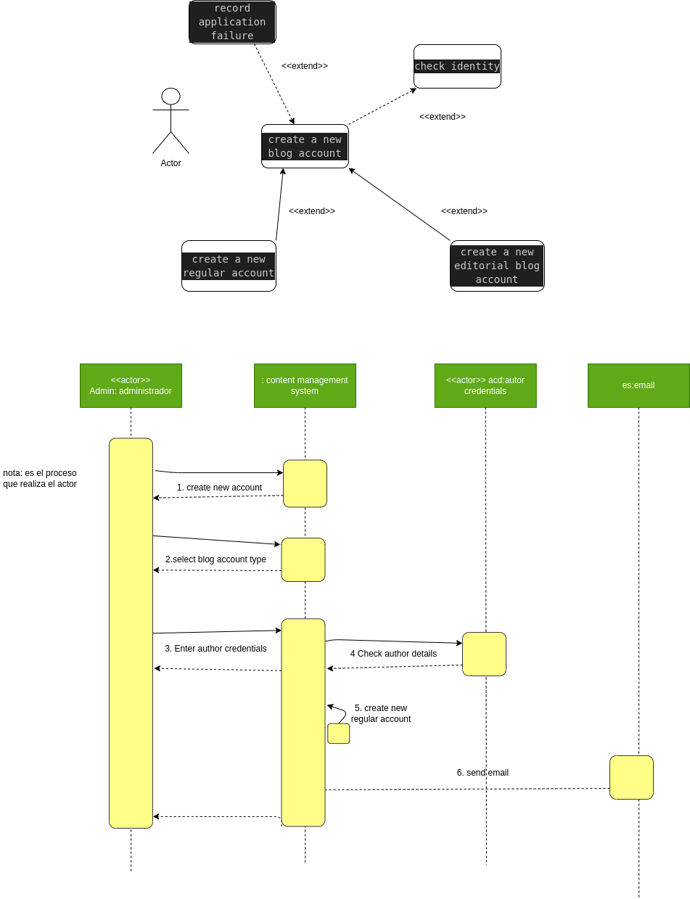

## Apuntes de diagramas de secuencias

## Flujo básico
1. El administrador pide al sistema crear una nueva cuenta de blog
2. El administrador selecciona el tipo de cuenta normal
3. EL administrador ingresa los detalles del autor
4. Los detalles del autor se verifican en la base de datos de credenciales
5. Una nueva cuenta de blog normal es creada
6. El resumen de la nueva cuenta se envia por correo

