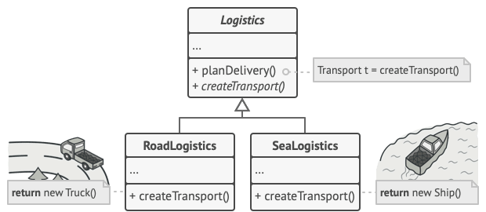

## El patrón Factory

El patrón Factory es un patrón de diseño creacional que permite crear objetos sin tener que especificar su clase exacta. Esto se logra mediante la creación de una interfaz o clase abstracta que define los métodos necesarios para crear un objeto, pero deja la implementación de esos métodos en las subclases.



> Vamos a utilizar un ejemplo sencillo en el que tendremos una jerarquía de clases Factura como se muestra a continuación:


> Vamos a ver cada clase en código:

```java
package com.arquitecturajava;

public abstract class Factura {

    private int id;
    private double importe;
    public int getId() {
        return id;
    }
    public void setId(int id) {
        this.id = id;
    }
    public double getImporte() {
        return importe;
    }
    public void setImporte(double importe) {
        this.importe = importe;
    }

    public abstract double getImporteIva();
}
```

```java
package com.arquitecturajava;

public class FacturaIvaReducido extends Factura{

@Override
 public double getImporteIva() {
 // TODO Auto-generated method stub
 return getImporte()*1.07;
 }

}
```

```java
package com.arquitecturajava;

public class FacturaIva extends Factura {

    @Override
    public double getImporteIva() {
        // TODO Auto-generated method stub
        return getImporte() * 1.21;
    }

}
```

## Beneficios del patrón Factory:

- Mejora la modularidad: El código se vuelve más modular, ya que la creación de objetos se encapsula en clases separadas.
- Facilita la reutilización: Las clases de fábrica se pueden reutilizar para crear diferentes tipos de objetos.
    Aumenta la flexibilidad: El código se vuelve más flexible, ya que se puede cambiar la forma en que se crean los objetos sin afectar al resto del código.